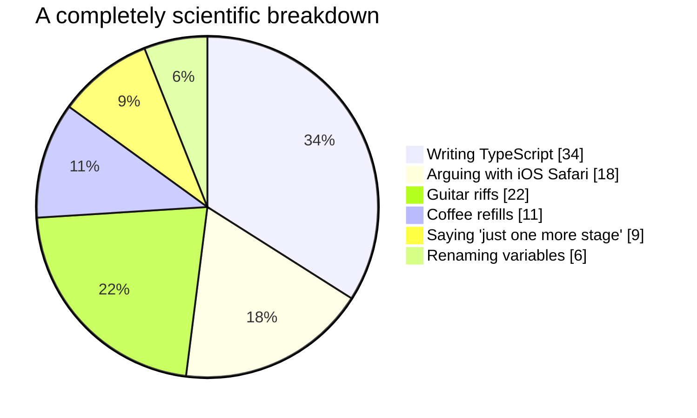

<!-- Profile README for github.com/ugurkarakurt — paste into the ugurkarakurt/ugurkarakurt repository. -->

<div align="center">


<a href="https://www.linkedin.com/in/u%C4%9Fur-karakurt-8b77b6154/"></a>
<a href="mailto:hello@ugurkarakurt.com"></a>
<a href="https://medium.com/@ugurkarakurt"></a>
<a href="https://x.com/ugurkarakurt"></a>
<a href="https://www.instagram.com/ugurkarakurt"></a>
<a href="https://www.pinterest.com/ugurkarakurt"></a>


</div>

---

## 🕹️ Player select

```ts
const player = {
  name: "Uğur Karakurt",
  class: "Senior Frontend Developer",
  level: 7,                         // years on the web, still grinding XP
  hp: "∞",                          // coffee-powered
  base: "Eskişehir, Türkiye",       // will relocate for the right map
  mainWeapon: ["React", "Next.js", "TypeScript"],
  sideArms: ["Tailwind", "Zustand", "TanStack Query"],
  specialMoves: ["HLS live video", "real-time UIs", "Cesium / Three.js maps"],
  passive: "first paint fast, 60 fps steady, works on a cheap phone on a bad connection",
  knownWeakness: "iOS Safari (we've met. many times.)",
  status: "🟢 open to new quests",
};
```

## 🏆 Achievements unlocked

<table>
  <tr>
    <td align="center" width="25%"><h1>7+</h1><sub>🕰️ years shipping for the web</sub></td>
    <td align="center" width="25%"><h1>15+</h1><sub>🚀 products delivered end to end</sub></td>
    <td align="center" width="25%"><h1>7</h1><sub>🛍️ enterprise retail brands shipped</sub></td>
    <td align="center" width="25%"><h1>25+</h1><sub>🧑‍🏫 devs trained in bootcamps</sub></td>
  </tr>
</table>

## 🛩️ Featured missions

<table>
  <tr>
    <td width="50%" valign="top">
      <h3>✈️ <a href="https://www.ugurkarakurt.com">ugurkarakurt.com</a></h3>
      <p>A portfolio that's secretly a game. Drag the plane off the home page into the warp gate and you're dropped into <b>UK / FLIGHT</b> — a Sky Force-style shoot-'em-up running right inside the site.</p>
      <p>
        
        
        
        
        
        
        
        
      </p>
      <details>
        <summary><b>📡 Full mission briefing</b></summary>
        <br />
        🌗 Two campaigns that follow the site's light and dark theme<br />
        🎨 Twelve hand-painted stages<br />
        👾 Flagship bosses<br />
        🔧 A hangar with upgrades<br />
        ☁️ Cloud saves<br />
        💬 Comic-book cutscenes with in-flight radio chatter
      </details>
    </td>
    <td width="50%" valign="top">
      <h3>🎸 <a href="https://trajedi.band">trajedi.band</a></h3>
      <p>Home of <b>TRAJEDİ</b>, the rock band I play guitar and write songs in — designed, built and maintained by me. Every release with its twelve streaming platforms, the gig calendar, member profiles and a press kit.</p>
      <p>Publishing a release is a content change, not a code change. Because the developer also has to be at rehearsal. 🤘</p>
      <p>
        
        
        
        
      </p>
    </td>
  </tr>
</table>

## 🗺️ Campaign log

| Stage | Years | Map | Boss defeated |
| :---: | --- | --- | --- |
| **5** | 2025 — 2026 | **PATH** · İstanbul — live betting & horse racing (TJK / Bitalih) | Bet slip & fixed-odds flows, the TJK TV live player (Video.js + HLS + draggable PiP), iOS Safari, App Router SSR |
| **4** | 2024 — 2025 | **Momentup** | One team, web *and* mobile — Next.js, TypeScript, React Native, from client analysis to cloud deploy |
| **3** | 2023 — 2024 | **Freelance** · Remote | 15+ products solo — scoping, auth & payments, CMS, hosting, CI. Every role, every boss. |
| **2** | 2021 — 2023 | **Akinon** | Enterprise storefronts for Superstep, GANT, Converse, English Home, The Kooples, Occasion & A101 |
| **1** | 2019 — 2021 | **Novumare** | Rendering the planet in a browser — ERP & geospatial on Cesium.js, Leaflet, Three.js + a reusable component library |

## 🧰 Loadout

<div align="center">


<br />

<br />


<sub>🎒 Also in the backpack: Zustand · TanStack Query · React Native · Framer Motion · Video.js / HLS · Cesium.js · Leaflet · Phaser · D3 · Zod</sub>

</div>

## ⏱️ Where the hours actually go



## 🎮 Off-screen side quests

| | |
| :---: | --- |
| 🎸 | Riffs and songwriting in **TRAJEDİ** — come say hi at a gig |
| 🎨 | Charcoal & acrylic, mostly big wall pieces |
| 🏔️ | Long treks, minimal gear |
| 🔧 | Real-time media & IoT tinkering — usually an excuse to learn a protocol properly |

## 📈 Flight data

<div align="center">


<br />

<br />


### 🐍 Contribution snake, eating my commits

<picture>
  <source media="(prefers-color-scheme: dark)" srcset="https://raw.githubusercontent.com/ugurkarakurt/ugurkarakurt/output/github-snake-dark.svg" />
  <source media="(prefers-color-scheme: light)" srcset="https://raw.githubusercontent.com/ugurkarakurt/ugurkarakurt/output/github-snake.svg" />
  
</picture>

</div>

---

<div align="center">

<sub><i>"Code is like music: the best songs are elegant, simple and powerful."</i></sub>
<br />
<sub>⬆️ ⬆️ ⬇️ ⬇️ ⬅️ ➡️ ⬅️ ➡️ 🅱️ 🅰️ — you found the bottom. Insert coin to continue.</sub>


</div>
